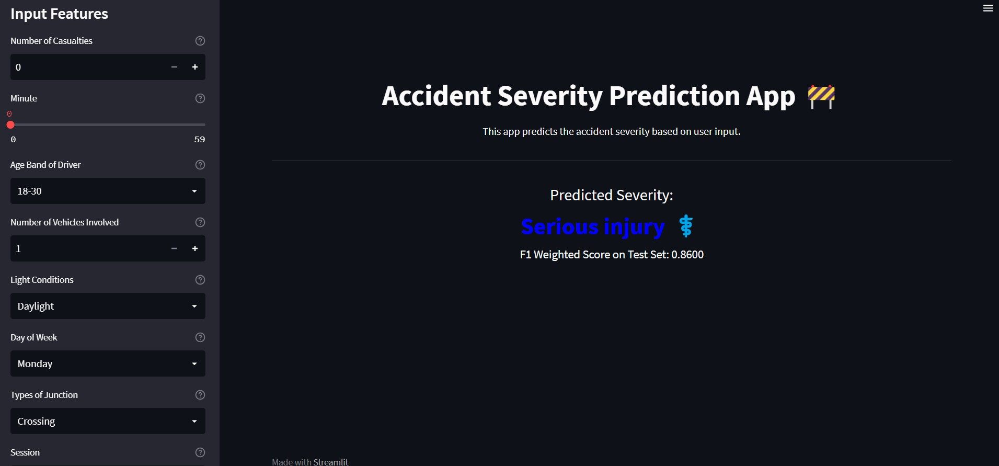

# Accident Severity Prediction


## Table of Contents
1. [Introduction](#introduction)
   - [Project Description](#project-description)
   - [Project Motivation](#project-motivation)
2. [Project Overview](#project-overview)
   - [Overview Dataset](#overview-dataset)
   - [Dataset Problem Statement](#dataset-problem-statement)
3. [Features](#features)
4. [Project Directory Structure](#project-directory-structure)
5. [Steps](#steps)
   - [Data Collection and Preprocessing](#data-collection-and-preprocessing)
   - [Feature Selection using ADASYN](#feature-selection-using-adasyn)
   - [Feature Importance and Test Score](#feature-importance-and-test-score)
   - [Streamlit Deployment](#streamlit-deployment)
6. [Requirements](#requirements)
7. [Usage](#usage)
8. [Screenshots](#screenshots)
9. [License](#license)
10. [Acknowledgements](#acknowledgements)
11. [Contact Information](#contact-information)

## Introduction <a name="introduction"></a>

### Project Description <a name="project-description"></a>

The objective of the Accident Severity Prediction project is to forecast the level of severity for accidents by leveraging a diverse set of input features. This initiative employs machine learning methodologies and is complemented by a user-friendly Streamlit web application for seamless interaction.

It's important to note that this project is designed with deployment in mind. In addition to the primary predictive model, the comprehensive project encompasses rigorous testing of various oversampling and undersampling techniques to address class imbalance. Moreover, it involves extensive experimentation with numerous categorical machine-learning models. For detailed information and access to the project's codebase, you can refer to the repository located at 'x'.

### Project Motivation <a name="project-motivation"></a>

Accident severity prediction has important real-world applications in traffic management, emergency response, and public safety. This project was motivated by the need to develop an accurate predictive model and showcase it through an interactive web application.

The goals of this project include:

- Implementing machine learning for accident severity prediction.
- Creating a user-friendly Streamlit app for easy access and input.
- Utilizing feature selection techniques like ADASYN to improve model performance.
- Demonstrating the practical use of machine learning in accident analysis.

## Project Overview <a name="project-overview"></a>

### Overview of the Dataset <a name="overview-dataset"></a>

The dataset used for this project contains records of accidents, including various attributes such as location, time, weather conditions, and more. The target variable is "Accident Severity," which represents the severity level of each accident.

#### Dataset Columns

- `Time`: The time of the accident.
- `Day_of_week`: The day of the week when the accident occurred.
- `Age_band_of_driver`: The age group of the driver involved in the accident.
- `Sex_of_driver`: The gender of the driver.
- `Educational_level`: The educational level of the driver.
- `Vehicle_driver_relation`: The relationship between the driver and the vehicle.
- `Driving_experience`: The driving experience of the driver.
- `Type_of_vehicle`: The type of vehicle involved in the accident.
- `Owner_of_vehicle`: The ownership status of the vehicle.
- `Service_year_of_vehicle`: The number of years in service of the vehicle.
- `Defect_of_vehicle`: The defects, if any, in the vehicle.
- `Area_accident_occurred`: The area where the accident occurred.
- `Lanes_or_Medians`: Information about lanes or medians at the accident location.
- `Road_alignment`: The alignment of the road.
- `Types_of_Junction`: The type of junction where the accident occurred.
- `Road_surface_type`: The type of road surface.
- `Road_surface_conditions`: The conditions of the road surface.
- `Light_conditions`: The lighting conditions at the time of the accident.
- `Weather_conditions`: The weather conditions at the time of the accident.
- `Type_of_collision`: The type of collision that occurred.
- `Number_of_vehicles_involved`: The number of vehicles involved in the accident.
- `Number_of_casualties`: The number of casualties in the accident.
- `Vehicle_movement`: Information about the movement of vehicles involved.
- `Casualty_class`: The class of casualties involved.
- `Sex_of_casualty`: The gender of casualties.
- `Age_band_of_casualty`: The age group of casualties.
- `Casualty_severity`: The severity of casualties.
- `Work_of_casualty`: The occupation or work of casualties.
- `Fitness_of_casualty`: The fitness level of casualties.
- `Pedestrian_movement`: Movement of pedestrians, if any.
- `Cause_of_accident`: The cause of the accident.
- `Accident_severity`: The severity of the accident.


### Dataset Problem Statement <a name="dataset-problem-statement"></a>

Given the highly unbalanced dataset with accident information, the task is to predict the severity of accidents. The severity levels may include "Slight injury," "Serious injury," and "Fatal injury." To address the class imbalance, this involves training a machine learning model using oversampling techniques like ADASYN to make accurate predictions based on the input features.

## Features <a name="features"></a>

- Preprocesses and explores the accident dataset.
- Utilizes ADASYN for feature selection to address class imbalance.
- Evaluates feature importance and their impact on the model.
- Deploys an interactive Streamlit web application for predictions.

## Project Directory Structure <a name="project-directory-structure"></a>

The project directory structure is organized as follows:


## Steps <a name="steps"></a>

1. **Data Collection and Preprocessing** <a name="data-collection-and-preprocessing"></a>
   - Gather the accident dataset containing relevant features.
   - Preprocess the data, handle missing values, and encode categorical variables.

2. **Feature Selection using ADASYN** <a name="feature-selection-using-adasyn"></a>
   - Address class imbalance using the ADASYN technique.
   - Select and shortlist features for model training based on ADASYN results.

3. **Feature Importance and Test Score** <a name="feature-importance-and-test-score"></a>
   - Train a machine learning model with selected features.
   - Evaluate feature importance and their impact on the model's performance.

4. **Streamlit Deployment** <a name="streamlit-deployment"></a>
   - Create an interactive Streamlit web application for accident severity prediction.
   - Deploy the web app to allow users to input accident details and receive predictions.

## Requirements <a name="requirements"></a>

To run the project, ensure you have the following requirements installed:

- Python 3.x
- Streamlit
- Pandas
- Scikit-learn
- ADASYN (for feature selection)

Install the required packages using the command `pip install -r requirements.txt`.

## Usage <a name="usage"></a>

1. Clone this repository to your local machine:
   ```bash
   git clone https://github.com/zubairashfaque/RTA_Deployment.git
   ```
2. Install the required packages:
   ```bash
   pip install -r requirements.txt
   ```
3. Do preprocessing for the dataset.
   ```bash
   python src/preprocessing.py data/raw/ data/processed
   ```
   
4. Oversampling.
   ```bash
   python src/preprocessing_oversampler.py data/processed data/processed/sample_data
   ```   
5. Model Training.
   ```bash   
   python ./src/train.py
   ``` 

6. Run the Streamlit app:
   ```bash
   streamlit run ./src/app.py
   ```
7. Running the Pipeline:
   ```bash
   make pipeline
   ```
## Screenshots
<p align="center"> 

</p>
<p align="center"> 

</p>


## License <a name="License"></a>

This project is licensed under the [MIT License](LICENSE).

## Acknowledgements <a name="Acknowledgements"></a>

- The machine learning model used in this project is based on the Extra Trees Classifier algorithm.
- Streamlit was utilized for creating the user-friendly interface.

## Contact Information <a name="Contact"></a>
For questions, feedback, or discussions related to this project, you can contact me at [mianashfaque@gmail.com](mailto:mianashfaque@gmail.com).
